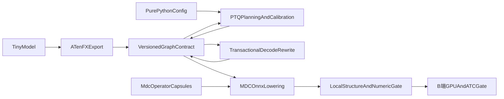

# MDC LLM Deploy 多阶段垂直构建计划

## 架构边界

- 以 [docs/PRD.md](docs/PRD.md) 为产品单一真源，[docs/designs/config.md](docs/designs/config.md) 为配置单一真源，[docs/ops](docs/ops) 为六算子契约。
- `models` 只定义 Tiny 模型；`config` 保持纯 Python；`graph` 统一承载 FX 阶段、ABI、融合边界、量化状态和事务式提交；`export` 只生成/改写 ATen FX；`quantization` 只规划、校准和 fake quant；`mdc_ops` 按算子封装 reference/Fake/设备实现/符号；`onnx_export` 独占 MDC 方言下沉和结构检查。
- 四个公开 Python API 保持薄层；不新增公开 CLI。验收 runner 属于内部工具，不成为产品接口。
- 用版本化 metadata dataclass、统一 capability matrix、集中 validator 消除跨模块字典约定和散落特判。

## 阶段 0：契约封板与工具链探针

- 修订 [docs/PRD.md](docs/PRD.md)：明确私有 `graph` 契约及 metadata 版本、标准中间 ONNX 生命周期、能力矩阵、`PASS/BLOCKED/WAIVED` 语义和不可豁免门禁；保留“仅 Python API、非真机可部署”边界。
- 固化 Python 3.12、目标 SoC、CANN/OPP/ATC 参数、超时和文本摘要格式；先在 B 端验证六个自定义节点及扩展 INT8 `MatMul` 的最小 parser 样例。
- 退出条件：命名、属性、domain、opset 18、RoPE layout 和 ATC 映射无悬而未决问题；B 端只拉取 A 端提交并回传文本摘要，不改代码、不回传产物。

## 阶段 1：可复现工程基线

- 建立 `pyproject.toml`、验证版本范围、带哈希锁、包导出、异常层、测试/静态检查配置。
- 完成无 torch 依赖的 `config`、Schema、指纹及五份验收 JSON；完成 Tiny Dense/MoE、固定 seed 权重、3072-token little-endian fixture。
- 垂直验收：全新 Python 3.12 环境可安装；配置可解析并稳定生成同一指纹；两模型前向的 logits/KV shape、dtype、哈希和确定性通过。
- 退出条件：后续阶段不得再改变模型结构、输入 ABI、fixture 或配置序列化。

## 阶段 2：首个 FP16 Dense 端到端切片

- 打通 `Tiny Dense -> export -> FLOAT_PREFILL FX -> masked prefill MDC ONNX`。
- 一次建正基础设施：版本化图 metadata、完整 validator、候选图检查后原子提交、标准 ONNX 临时检查、MDC 方言检查、原子文件写入。
- 只实现该切片需要的 `RmsNorm`、`ApplyRotaryPosEmb`、`FusedInferAttentionScore` 算子胶囊；每个同时完成 CPU reference、Fake/Meta、GPU/NPU Triton、设备分派、opset 18 符号和独立测试。
- B 端门禁：三算子 GPU 数值测试；单份 FP16 Dense masked-prefill ONNX 完成 ATC/OM。
- 退出条件：原模型与 FX 数值等价；ONNX ABI/结构正确；失败无图状态污染、无半成品文件。

## 阶段 3：Linear MinMax W8A8 端到端切片

- 建立通用 `selector -> planner -> calibration -> algorithm -> materialization` 流程，但首个消费者仅为 Dense linear。
- 完成 FP32 统计、ties-to-even、全零规则、fake quant metadata；实现 `AscendQuantV2`、`AscendDequant` 完整算子胶囊和 W8 linear 下沉。
- 垂直验收：同一 Dense masked-prefill 输入完成 `FLOAT_PREFILL -> QUANTIZED_PREFILL -> MDC ONNX -> ATC/OM`；量化整数与独立 reference 完全一致。
- B 端门禁：Quant/Dequant GPU 数值测试及该切片 ATC；不得用 ONNX 导出器内的 linear 特判绕过 planner 或 capability matrix。

## 阶段 4：Attention、mask 模式与 Decode 切片

- 扩展同一 MinMax 流程支持 Q/K/V/score；实现 `convert_to_decode` 的原子状态迁移、绝对位置 3071 参数复用、浮点/INT8 KV Cache ABI。
- 将 Dense 能力补齐到 FP16、linear、attention 三条路径，各自覆盖 prefill/decode 与 masked/maskless；显式验证 maskless 是全可见 non-causal 语义。
- 垂直验收：prefill 最后 token 与“3071 cache + 单 token decode”的 logits/KV 等价；非法阶段、非对称 Q/score、INT4 decode cache 在规定层报固定异常。
- B 端门禁：Dense 代表性 FP16/linear/attention 的 decode 与 maskless ATC；门禁通过后冻结 Dense 路径。

## 阶段 5：MoE 端到端切片

- 完成 MoE 模式发现、routed/shared expert 归组、显式 packing metadata、`MoeExpert` 完整算子胶囊和 MinMax-MoE 下沉；router 继续复用 linear 规划。
- 垂直验收：Tiny MoE 的 FP16、linear、attention、moe 路径全部覆盖 prefill/decode 与 masked/maskless；断言 expert id、权重顺序、offset、21 项 scale/offset 契约。
- B 端门禁：`MoeExpert` GPU 数值测试；MoE prefill/decode 代表项 ATC。此阶段结束，本地应能生成并结构验证完整 28 份 FP16/MinMax ONNX。

## 阶段 6：GPTQ FX 独立切片

- 在既有 selector/planner/calibration 接口上增加 GPTQ 策略，不复制 MinMax 流程；实现 Dense linear W4A8、MoE W8A8、Hessian/Cholesky 和限定原因的 MinMax 回退元数据。
- 垂直验收止于 FX：量化整数、反量化值、target 选择、回退 FQN/原因均与独立 reference 一致；`onnx_export` 对 GPTQ/W4 稳定抛出 `OnnxExportError`。
- 退出条件：GPTQ 不侵入 ONNX/ATC 路径，不阻塞已冻结的 FP16/MinMax 能力。

## 阶段 7：发布候选封板

- A 端运行全量单测、数值、结构、异常原子性、Schema 同步、静态 NPU kernel 检查；清理临时 ONNX、fixture 生成物、缓存和日志。
- B 端运行六算子 GPU 测试和 28 项 ONNX/ATC/OM 矩阵；摘要记录 commit、干净状态、依赖/锁 hash、环境、命令、退出码、GE 映射和产物 SHA-256。
- 将可复用结论整理到 `docs/validation/b-side.md`；B 端文件留在 B 端并清理中间物。发布措辞只允许“面向 MDC 的 ONNX”或“已通过 ATC 编译”，不声明 MDC 真机可运行。

## 全程门禁

- 每阶段必须同时有成功路径、边界错误、失败不变性、独立 reference；只通过单元测试不算垂直完成。
- 新能力只能通过既有契约扩展：新增 metadata 字段先升级 schema/validator，新增量化组合先更新 capability matrix，新增算子能力留在对应算子胶囊。
- 阶段退出后冻结其公开行为；后续失败优先修正抽象或契约，禁止调用点特判、重复量化实现、导出期回头解析模型。
- 每个 B 端门禁失败先定位并修复；只有契约定义允许的项目可 `WAIVED`，且必须留下复现命令、根因、影响和批准记录。

